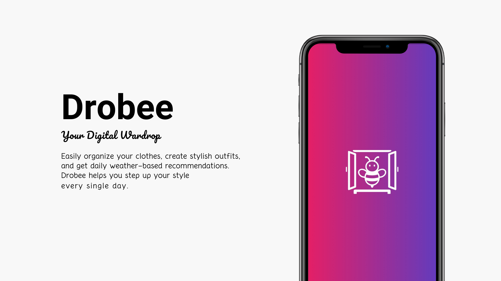
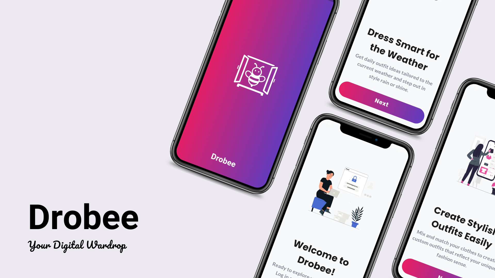
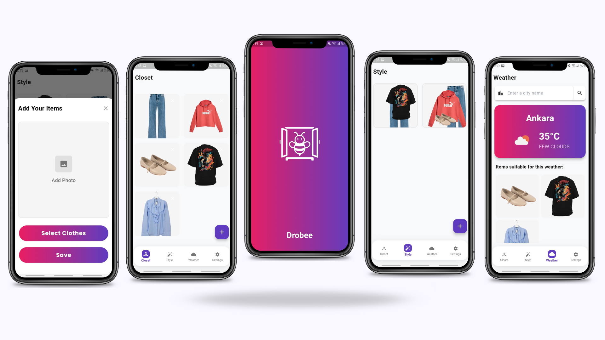

# 🐝 Drobee – Your Smart Digital Wardrobe  

  

> A Flutter app that connects your wardrobe to the weather.

**Drobee** is a Flutter-based mobile application that enables users to digitize their wardrobe, categorize clothing, design outfit combinations, and receive daily suggestions based on real-time weather.  
It is fully integrated with powerful **Firebase** services to provide a smooth and secure user experience.

---

  
  
  

---

## 🚀 Features

- 📸 **Add Clothing Photos** – Upload clothes via camera or gallery  
- 🧥 **Category Management** – Organize items as tops, bottoms, outerwear, etc.  
- 🌦️ **Weather-Based Suggestions** – Receive outfit suggestions based on real-time weather (OpenWeatherMap API)  
- 🧩 **Outfit Builder** – Design your outfits visually with drag-and-drop  
- 🔐 **Secure Login** – Sign in via email/password or Google (Firebase Authentication)  
- ☁️ **Cloud Storage** – Store and manage wardrobe data with Firestore  
- ⚙️ **Dynamic API Keys** – Use Firebase Remote Config to update API keys dynamically  
- 🖼️ **External Image Hosting** – Host images on FreeImage.Host to optimize Firebase Storage usage

---

## 🛠️ Tech Stack

| Layer              | Technologies                                |
|--------------------|---------------------------------------------|
| UI                 | Flutter + Dart                              |
| State Management   | Bloc (Cubit architecture)                   |
| Backend Services   | Firebase (Authentication, Firestore, Remote Config) |
| API Integrations   | OpenWeatherMap, Remove.bg, FreeImage.Host   |
| Responsive Design  | flutter_screenutil                          |
| Animations         | Lottie                                      |

---

## 📲 Screenshots

  
  

